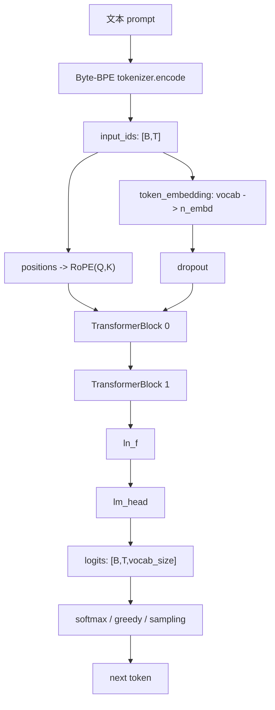
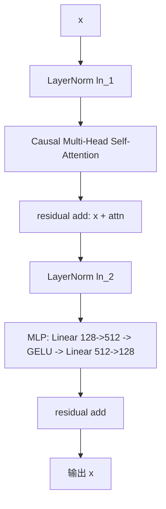

# MiniLLM 模型结构、推理引擎接入与 AI Infra 路线

## 1. 一个语言模型通常有哪些部分

以 decoder-only GPT 类模型为例，一个可训练/可部署模型通常包括：

| 部分 | 保存位置 | 作用 |
| --- | --- | --- |
| tokenizer | `tokenizer.json` / tokenizer 代码 | 把文本变成 token id，再把 token id 解码回文本 |
| config | `config.json` | 描述模型结构，例如层数、隐藏维度、头数、上下文长度 |
| weights | `model.safetensors` / `.pt` | 所有可训练参数 |
| model code | Python/C++/CUDA/Triton | 定义 forward 如何从 input_ids 计算 logits |
| generation config | `generation_config.json` | 默认 temperature/top-k/top-p/max tokens 等生成参数 |
| serving/runtime | vLLM/SGLang/nano-vLLM/server | 负责 batching、KV cache、scheduler、API |

MiniLLM 当前具备 tokenizer、config、weights、PyTorch model code、learned/RoPE 位置编码、HF-like export、nano-vLLM/vLLM 后端和 mini-sglang 教学服务层。

## 2. 当前 MiniLLM 的结构

当前 checkpoint 配置：

```text
vocab_size = 512
block_size = 128
n_layer    = 2
n_head     = 4
n_embd     = 128
dropout    = 0.1
bias       = True
position_encoding = rope
rope_theta = 10000
```

结构图：



单个 TransformerBlock：



每层作用：

| 层 | 当前实现 | 作用 |
| --- | --- | --- |
| Byte-BPE tokenizer | 512 token 词表 | 把文本切成 byte/subword token；仍可切回 Char/SentencePiece/HF adapter |
| token_embedding | `nn.Embedding(512,128)` | 把离散 token id 变成连续向量 |
| RoPE | Q/K half-split rotation | 用相位旋转注入位置；旧 checkpoint 仍支持 learned absolute position |
| CausalSelfAttention | MHA, 4 heads | 让每个 token 从历史上下文取信息，mask 防止看未来 |
| MLP | 4x hidden GELU MLP | 每个位置独立做非线性特征变换 |
| LayerNorm | pre-norm + final norm | 稳定激活和训练 |
| residual | `x + branch(x)` | 让深层网络更容易优化 |
| lm_head | tied token embedding | 把隐藏状态映射为词表 logits |

## 3. checkpoint 的组成

`projects/minillm/checkpoints/minillm.pt` 是一个 PyTorch checkpoint dict：

```text
model      -> state_dict，所有权重张量
config     -> GPTConfig 字段
tokenizer  -> stoi/itos/unk_token
args       -> 训练脚本参数，例如 data/max_steps/batch_size/lr/device
```

当前 checkpoint 是用：

```text
data/teaching_corpus.txt
max_steps=1500
batch_size=64
block_size=128
device=cuda
```

训练出来的。

HF-like 导出目录：

```text
hf_exports/minillm/
  config.json
  model.safetensors
  tokenizer.json
  tokenizer_config.json
  generation_config.json
  README.md
```

注意：它是教学 HF-like 格式，不等于完整 Hugging Face `PreTrainedModel`。

## 4. 我们是否完成了 fine tuning

还没有。当前只完成了 next-token prediction 形式的预训练/继续预训练：

```text
x = token[0:T]
y = token[1:T+1]
loss = CrossEntropy(model(x), y)
```

`teaching_corpus.txt` 虽然是问答格式，但训练方式仍然是普通 causal LM。严格的 SFT 通常要明确区分：

```text
prompt tokens   -> 只作为条件
response tokens -> 计算 loss
```

也就是需要 loss mask，只在 assistant 答案部分反向传播。

## 5. fine tuning 的方法原理和论文来源

常见路线：

| 方法 | 原理 | 参考 |
| --- | --- | --- |
| SFT | 用人工/模型生成的指令-回答对继续训练，让模型学会遵循指令 | InstructGPT 使用 supervised fine-tuning 作为第一阶段 |
| LoRA | 冻结原权重，只训练低秩 adapter 矩阵 | LoRA: Low-Rank Adaptation of Large Language Models |
| DPO/RLHF | 用偏好数据让模型更符合人类偏好 | InstructGPT/RLHF，DPO |
| QLoRA | 量化基座模型，同时训练 LoRA adapter | QLoRA |

核心论文链接：

- Transformer: https://arxiv.org/abs/1706.03762
- GPT-3 / in-context learning: https://arxiv.org/abs/2005.14165
- FLAN / instruction tuning: https://arxiv.org/abs/2109.01652
- InstructGPT / RLHF: https://arxiv.org/abs/2203.02155
- LoRA: https://arxiv.org/abs/2106.09685
- QLoRA: https://arxiv.org/abs/2305.14314
- FlashAttention: https://arxiv.org/abs/2205.14135
- vLLM / PagedAttention: https://arxiv.org/abs/2309.06180

## 6. 为什么需要 teaching corpus

因为 MiniLLM 太小、训练数据太少。如果直接用很杂的语料，小模型会学不到稳定格式。

`teaching_corpus.txt` 的作用是：

- 用重复且清晰的 `用户:/助手:` 格式让模型学会问答模式。
- 用短概念解释降低学习难度。
- 让 2 层、128 hidden 的小模型可以快速过拟合教学任务。
- 方便观察 loss 下降和生成效果。

它不是生产 SFT 数据，只是教学数据。

## 7. 一般 SFT 需要哪些东西

| 组件 | 为什么需要 | 来源 |
| --- | --- | --- |
| base model | SFT 是在预训练模型上继续训练 | 自己预训练或开源模型 |
| tokenizer/chat template | 把多轮对话稳定编码成 token | 模型自带 tokenizer 或自定义 |
| instruction/prompt | 告诉模型用户需求 | 人工写、日志清洗、合成数据 |
| response | 模型应该学习的答案 | 人工标注、强模型生成、专家数据 |
| loss mask | 只训练 assistant 回答，不训练 prompt | 数据预处理生成 |
| train/val split | 观察泛化和过拟合 | 数据集划分 |
| trainer | batch、loss、backward、optimizer、checkpoint | 原生 PyTorch/Trainer/Accelerate/DeepSpeed |
| eval set | 评估指令跟随和质量 | 自建 benchmark 或公开 benchmark |

MiniLLM 下一步要补的是 SFT dataset + loss mask + `train_sft.py`。

## 8. 什么叫“引擎认识模型结构”

推理引擎不是拿到任意 `model.safetensors` 就能跑。它要能完成下面映射：

```text
config.json:
  model_type = "minigpt"
  architectures = ["MiniGPTForCausalLM"]

engine registry:
  "MiniGPTForCausalLM" -> MiniGPTForCausalLM 实现类

weight loader:
  safetensors key -> 模型参数名

runtime forward:
  input_ids + positions + KV cache metadata -> hidden_states -> logits
```

如果 registry 里没有这个 architecture，引擎就“不认识”这个模型。

## 9. 四类引擎接入要求

| 引擎 | 当前状态 | 接入模型需要什么 | 高性能在哪里实现 |
| --- | --- | --- | --- |
| nano-vLLM | MiniGPT 后端已验证 learned/RoPE | config 分支、MiniGPTForCausalLM、tokenizer、weight loader | nano-vLLM `Attention`、paged KV cache、scheduler、sampler |
| vLLM | MiniGPT native backend 已验证 learned/RoPE | `model_executor/models/minigpt.py`、registry、config registry、HF tokenizer/weights | vLLM `Attention`、paged KV cache、scheduler、CUDA graph、quant layers |
| SGLang | 尚未做 native MiniGPT | `python/sglang/srt/models/minigpt.py`、EntryClass、RadixAttention、ForwardBatch、weight loader | SGLang `RadixAttention`、prefix cache、scheduler、FlashInfer |
| mini-sglang | 本轮新增教学服务 | 直接加载 MiniLLM checkpoint，提供 OpenAI-like HTTP API | 目前没有高性能 runtime，只用于学习服务层 |

结论：针对某一个模型的高性能，必须在引擎内部的模型实现类和 attention/KV cache 接口中实现。单纯有 PyTorch `forward()` 不等于高性能部署。

### SGLang 和 RadixAttention 的关系

不是把 `RadixAttention` 写进 `projects/minillm/minillm/model.py`。MiniLLM 原始模型应该继续保持“结构定义 + 训练 + 权重”的角色。

真正要做的是在 SGLang 内部新增一个 MiniGPT 后端：

```text
projects/sglang/python/sglang/srt/models/minigpt.py
```

这个后端要把 MiniLLM 的逻辑改写成 SGLang runtime 接口：

```text
MiniLLM CausalSelfAttention
  -> SGLang QKVParallelLinear
  -> SGLang RadixAttention
  -> SGLang ForwardBatch / token_to_kv_pool / prefix cache
```

也就是说：

```text
minillm 负责定义模型结构和产出权重
sglang backend 负责用 SGLang 的高性能 attention/runtime 执行这个结构
```

如果直接在 MiniLLM 里依赖 SGLang 的 RadixAttention，会让训练代码、教学代码和推理引擎强耦合，反而不利于学习和维护。

## 9.1 当前验证状态

| 引擎 | 验证结果 | 说明 |
| --- | --- | --- |
| mini-sglang | 通过 | `/health` 和 `/v1/completions` 已返回 JSON |
| nano-vLLM | 通过 | `scripts/run_nanovllm_minigpt.py` 已加载 learned/RoPE HF-like export 并生成 |
| vLLM | 通过 | 本地 editable 源码中的 MiniGPT registry、safetensors、RoPE、paged KV cache、Triton attention 和 token 生成已验证；greedy token IDs 与 native 完全一致 |
| SGLang | 未实现 native backend | 需要后续新增 `sglang/srt/models/minigpt.py` 并接 RadixAttention |

vLLM 验证口径：

```text
全量从源码编译 CUDA/C++ 扩展：尝试过，但超过 30 分钟未完成。
当前通过的构建方式：复用已安装 wheel 中的编译扩展，安装本地 Python 源码为 editable package。
验证模型：/home/undefined/Desktop/ai/projects/minillm/hf_exports/minillm-rope
验证调用：LLM(..., dtype="float32", enforce_eager=True)
验证结果：engine 初始化、完整权重加载、RoPE、KV cache 分配和 16 个 greedy token 均通过；输出 token IDs 与 native KV-cache 路径逐项相同。
```

## 10. vLLM / nano-vLLM 外层服务层

### vLLM

vLLM 的 OpenAI 服务层在：

```text
vllm/entrypoints/openai/api_server.py
vllm/entrypoints/openai/chat_completion/
vllm/entrypoints/openai/completion/
```

典型路径：

```text
HTTP /v1/chat/completions
-> OpenAI serving layer
-> AsyncLLMEngine
-> scheduler
-> model executor
-> sampler
-> response
```

### nano-vLLM

当前 nano-vLLM 主要是 Python `LLM.generate()` 教学接口，没有完整 OpenAI API server。要补服务层，需要：

```text
FastAPI/HTTP server
-> /v1/completions /v1/chat/completions
-> tokenizer/chat template
-> LLM.generate()
-> JSON response
```

### mini-sglang

本轮新增：

```text
projects/mini-sglang/mini_sglang_server.py
```

支持：

```text
GET  /health
POST /v1/completions
POST /v1/chat/completions
```

它展示服务层，不展示高性能调度。

## 11. AI Infra 完整要求表

| 阶段 | 生产要求 | MiniLLM 当前 |
| --- | --- | --- |
| 数据 | 大规模清洗、去重、混合配比 | 20k 字符 teaching corpus |
| tokenizer | BPE/SentencePiece/chat template | Char、Byte-BPE、SentencePiece、HF adapter；chat template 待完善 |
| 预训练 | 大规模 next-token training | 已完成 toy pretrain |
| SFT | prompt/response/loss mask | 未完成 |
| LoRA | adapter 训练与合并 | 未完成 |
| 偏好优化 | DPO/RLHF/奖励模型 | 未完成 |
| 评估 | ppl、benchmark、回归测试 | 只有简单生成观察 |
| HF 格式 | PreTrainedModel/save_pretrained | 只有 HF-like |
| 原生推理 | PyTorch generate/KV cache | 已有 |
| 推理引擎 | vLLM/SGLang native backend | nano-vLLM 与 vLLM 已验证；SGLang 待实现 |
| 服务层 | OpenAI-compatible API | mini-sglang 教学服务 |
| 量化 | INT8/INT4/GPTQ/AWQ/QLoRA | 未完成 |
| 算子优化 | FlashAttention/Triton/CUDA | 未完成 |
| 部署 | Docker/systemd/监控/日志 | 未完成 |

## 12. 最终目标路线

目标是把 MiniLLM 逐步变成流行 GPT 风格：

1. 字符 tokenizer -> BPE/SentencePiece。
2. learned position embedding -> RoPE：已完成，并保留兼容模式。
3. LayerNorm -> RMSNorm。
4. GELU MLP -> SwiGLU。
5. MHA -> GQA/MQA 可选。
6. 原生 SFT + loss mask。
7. LoRA fine-tuning。
8. 真正 HF `PreTrainedModel`。
9. nano-vLLM paged KV cache：已接入 MiniGPT attention 路径。
10. vLLM native backend 验证：已完成 RoPE 与 greedy token 对齐。
11. SGLang RadixAttention backend。
12. OpenAI-compatible server。
13. 量化压缩和 kernel 优化。

当前最应该做的下一步是：先固定 RoPE+BPE 评测基线，再依次实现可选 RMSNorm、SwiGLU、GQA 和训练 resume/AMP，随后做 SFT loss mask 与 LoRA。详细顺序见 `docs/rope_implementation_and_roadmap.md`。
